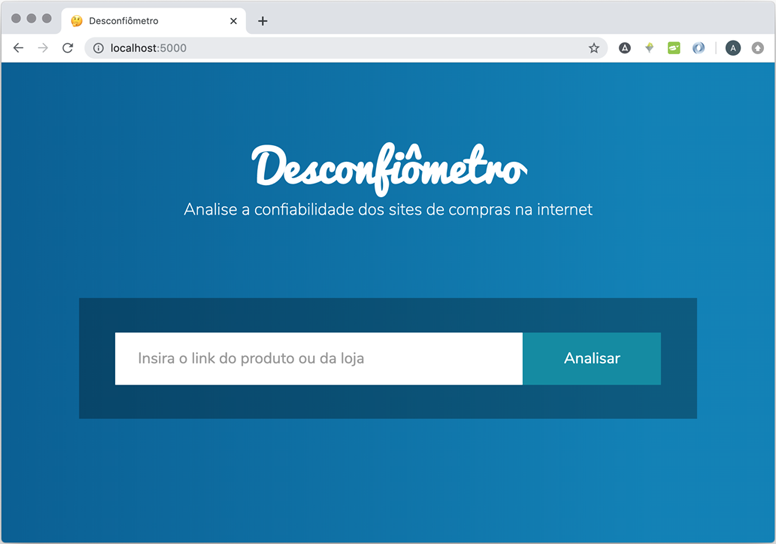

<div align="center"></div>

O **Desconfiômetro** foi o resultado de um final de semana de programação no [Hackfest RS 2019](https://www.mprs.mp.br/hotsite/hackfestrs/).

O objetivo do projeto é fornecer uma maneira simples e gratuita para que o consumidor possa **verificar a segurança de um site de compras** e se sentir seguro para finalizar a compra.

Isto se dá através de uma interface web, onde o usuário insere o link do produto que deseja comprar, que então será enviado para nosso backend e analisado sob vários critérios.

<div align="center"></div>

## Tecnologias

Para implementar o projeto, escolhemos a linguagem **Python** versão *3.5.2*, e utilizamos o framework [Flask](https://palletsprojects.com/p/flask/) para a criação do servidor web.

## Comandos

### Instalando as dependências

Para instalar as dependências, execute:

```
make install
```

Para rodar o projeto, execute:

```
make run
```

## Grupo

Nossa equipe é formada por:

- [Augusto Boranga](http://github.com/gutoboranga)
- [Christian Schmitz](http://github.com/christians342)
- [Lúcio Franco](http://github.com/lucio-lpf)


Projeto desenvolvido no Hackfest RS 2019. A ideia é fornecer uma maneira simples para o consumidor verificar a segurança de um site em de compras.